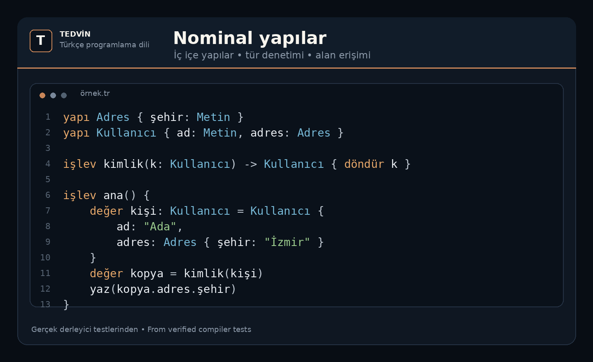
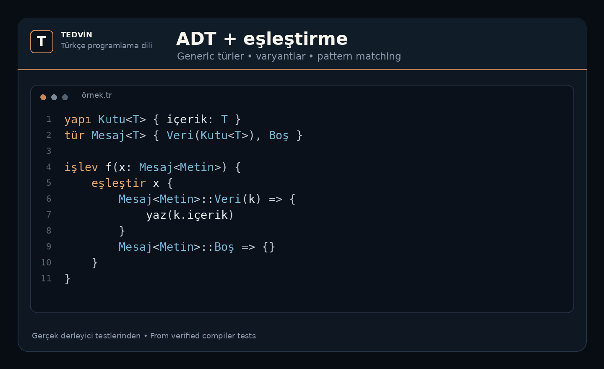
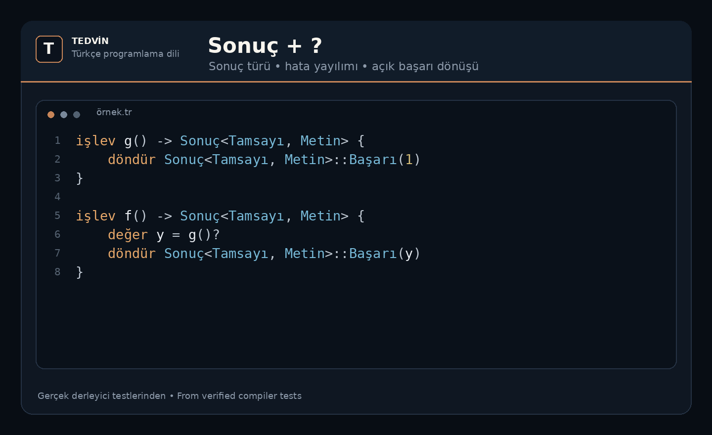

<h1 align="center">TEDVİN</h1>

  <strong>Türkçe kodlama için tasarlanmış bir programlama dili ve geliştirme ortamı.</strong> 
  <em>A programming language and development environment designed for coding in Turkish.</em>

  
  
  
  

---

## Türkçe kod, gerçek bir compiler.

TEDVİN yalnızca anahtar kelimeleri Türkçeleştiren bir sözdizimi deneyi değildir.

Proje; lexer, parser, isim çözümleme, tür denetimi, HIR tabanlı anlamsal katmanlar, hata tanıları ve dil özelliklerini doğrulayan test yüzeyiyle birlikte geliştirilen gerçek bir compiler altyapısıdır.

**TEDVİN is not just a translated syntax experiment.** It is being developed as a complete language toolchain with parsing, semantic analysis, diagnostics, compiler representations, and language-level verification.

### Mevcut geliştirme yüzeyinden bazıları

- Türkçe anahtar kelimeler ve Türkçe Unicode tanımlayıcılar
- Nominal yapılar ve tür denetimli alan erişimi
- Generic türler ve generic işlevler
- Algebraic Data Types (ADT)
- Pattern matching / `eşleştir`
- Yerleşik `Seçenek` ve `Sonuç` türleri
- `?` ile `Sonuç` yayılımı
- Etki (effect) analizi
- Deterministik compiler tanıları

---

## Kod nasıl görünüyor? / What does TEDVİN look like?

Aşağıdaki kodlar mevcut doğrulanmış compiler testlerinden türetilmiş gerçek TEDVİN örnekleridir.

### Nominal yapılar

  

### ADT + eşleştirme

  

### `Sonuç` + `?`

  

---

## Doğrulama / Verification

Mevcut private geliştirme snapshot'ında:

**627 compiler unit test + lexer ve resolver fixture testleri başarıyla geçiyor.**

The current private development snapshot passes **627 compiler unit tests plus lexer and resolver fixture suites**.

TEDVİN aktif geliştirme aşamasındadır ve henüz kararlı sürüm ilan edilmemiştir.

---

## Kaynak kod / Source availability

TEDVİN compiler kaynak kodu aktif geliştirme sürecinde **private** tutulmaktadır.

Bu profil, projenin halka açık geliştirme vitrini olarak kullanılacaktır. Kaynak kodun erişim ve dağıtım politikası daha sonra duyurulacaktır.

The compiler source is currently **private while the language is under active development**. This profile is the public development showcase for TEDVİN.

---

  <strong>TEDVİN</strong> 
  Türkçe kodlama için tasarlanmış bir programlama dili ve geliştirme ortamı.

