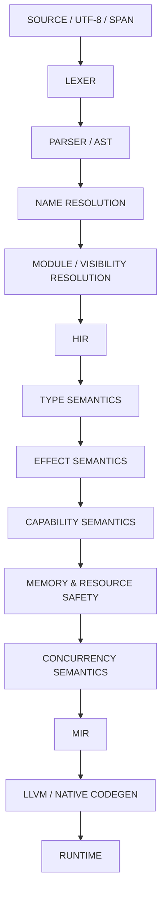
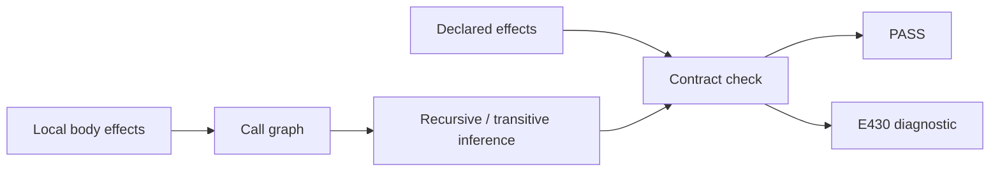

<div align="center">
# TEDVİN
### Türkçe kodlama için tasarlanmış bir programlama dili ve geliştirme ortamı.
*A programming language and development environment designed for coding in Turkish.*
<br>


<br>
**Türkçe kod. Gerçek compiler semantiği. Uzun vadeli native toolchain hedefi.**
[Ne?](#tedvin-nedir--what-is-tedvin) ·
[Farkı](#neden-farklı--why-it-stands-out) ·
[Bugün](#bugün-ne-var--what-exists-today) ·
[Mimari](#compiler-mimarisi--compiler-architecture) ·
[Effect](#effect-semantics--derleyicinin-gördüğü-davranış) ·
[Ortam](#tedvin-geliştirme-ortamı--development-environment) ·
[Yol Haritası](#yol-haritası--roadmap) ·
[Kod](#kod-nasıl-görünüyor--code-examples)
</div>
---
# TEDVİN nedir? / What is TEDVİN?
TEDVİN, **Türkçe kodlama için tasarlanmış** bir programlama dili ve geliştirme ortamıdır.
Amaç, birkaç İngilizce anahtar kelimeyi Türkçeye çevirmek değildir. Proje; kaynak koddan başlayıp lexer, parser, isim çözümleme, HIR, tür semantiği, hata tanıları ve effect analizine uzanan **gerçek bir compiler mimarisi** üzerinde geliştirilmektedir.
> **TEDVİN'in iddiası:** Türkçe kod yazmanın yalnızca okunabilir bir sözdizimi değil, compiler tarafından güçlü ve tutarlı biçimde doğrulanan gerçek bir programlama deneyimi olması.
**English:** TEDVİN is being built as a real programming language toolchain—not as a keyword-translation demo. The project combines a Turkish coding surface with compiler-enforced semantics, diagnostics, type reasoning, effect analysis, and a long-term native-toolchain direction.
---
# Neden farklı? / Why it stands out
TEDVİN'in farkı tek bir özelliğin “dünyada ilk” olması değildir.
`Sonuç`, algebraic data types, traits veya effect sistemleri gibi fikirlerin tek başına TEDVİN'e özgü olduğu iddia edilmiyor. **Fark yaratan şey bunların aynı tasarım çizgisinde, Türkçe kodlama yüzeyiyle ve compiler-merkezli bir mimariyle birleştirilmesi.**
<table>
<tr>
<td width="50%" valign="top">
### 01 — Türkçe, dilin gerçek yüzeyi
Türkçe yalnızca editörde gösterilen bir etiket katmanı değildir.
Kabul edilmiş dil yüzeyinde örneğin:
```text
değer
değişken
eğer
değilse
iken
kır
sürdür
yapı
eşleştir
döndür
```
gibi gerçek dil yapıları bulunur.
Türkçe Unicode tanımlayıcılar da compiler tarafından doğrudan desteklenir.
</td>
<td width="50%" valign="top">
### 02 — Tek semantik otorite
TEDVİN'de dilin anlamının bir kısmının dökümantasyonda, başka bir kısmının araçlarda “yaklaşık” yaşaması hedeflenmez.
**Compiler, dil semantiğinin tek otoritesi olarak tasarlanır.**
Builtin davranışları bile yalnızca isim benzerliğiyle değil, gerçek semantic identity üzerinden bağlanır.
</td>
</tr>
<tr>
<td width="50%" valign="top">
### 03 — `null` yerine açık güvenli modeller
Tasarım yönü:
```text
T?  ≡  Seçenek<T>
```
Ham `null`, güvenli dil modelinin merkezi değildir.
Kurtarılabilir hatalar:
```text
Sonuç<T, H>
```
üzerinden modellenir.
Postfix `?`, yalnızca resmi `Sonuç<T,H>` taşıyıcısı için tanımlı kontrollü hata yayılımıdır.
</td>
<td width="50%" valign="top">
### 04 — Effect semantiği çekirdeğin parçası
TEDVİN yalnızca “bu kodun tipi nedir?” sorusuyla ilgilenmez.
Compiler mimarisinde ayrıca:
**“Bu kod ne yapıyor?”**
sorusu da modellenir.
Yerel, transitif ve recursive effect çıkarımı ile public effect contract denetimi bugünkü doğrulanmış compiler yüzeyinin parçasıdır.
</td>
</tr>
<tr>
<td width="50%" valign="top">
### 05 — Deterministik compiler davranışı
Compiler geliştirme çizgisinde:
- fail-closed kontroller,
- stable semantic identity,
- deterministic ordering,
- exact diagnostic contracts,
- regression-bound acceptance
temel ilkeler olarak kullanılır.
Hedef yalnızca güçlü bir dil değil, **öngörülebilir bir compiler**dır.
</td>
<td width="50%" valign="top">
### 06 — Küçük core, genişletilebilir ekosistem
Dil çekirdeğine yalnızca program anlamını, güvenliğini veya compiler garantilerini belirleyen özellikler alınır.
HTTP, JSON, database, GUI, web framework, AI/ML ve cloud SDK'lar **core-language feature** olarak tasarlanmaz; stdlib/package katmanında büyümeleri hedeflenir.
</td>
</tr>
</table>
---
# Bugün ne var? / What exists today
## Doğrulanmış compiler yüzeyi
Mevcut private geliştirme snapshot'ında **627 compiler unit testi** ile lexer ve resolver fixture testleri başarıyla geçmektedir.
Bugün doğrulanmış semantic yüzey şunları kapsar:
- ✓ Türkçe anahtar kelimeler ve Türkçe Unicode tanımlayıcılar
- ✓ `değer` ile immutable binding
- ✓ `değişken` ile explicit mutable binding
- ✓ Boolean, equality, comparison ve logical operators
- ✓ `eğer` / `değilse` structured branching
- ✓ `iken` loop modeli
- ✓ `kır` / `sürdür` loop control
- ✓ nominal `yapı` declarations
- ✓ typed field construction ve field access
- ✓ generic types ve generic functions
- ✓ Algebraic Data Types (ADT)
- ✓ generic ADT payloads
- ✓ `eşleştir` pattern matching
- ✓ exhaustiveness checking
- ✓ unreachable pattern detection
- ✓ official `Seçenek<T>`
- ✓ official `Sonuç<T,H>`
- ✓ `T?` → `Seçenek<T>` type sugar
- ✓ `expr?` → `Sonuç<T,H>` error propagation
- ✓ HIR tabanlı semantic katmanlar
- ✓ structured compiler diagnostics
- ✓ terminal diagnostic renderer
- ✓ local/transitive/recursive effect inference
- ✓ public effect-contract enforcement
### Bir parser demosundan daha fazlası
```text
Kaynak kod
    ↓
Token
    ↓
AST
    ↓
Resolution
    ↓
HIR
    ↓
Type semantics
    ↓
Effect semantics
    ↓
User diagnostics
```
Bu zincirin önemli bölümü bugün gerçek compiler testleriyle doğrulanmaktadır.
---
# Compiler mimarisi / Compiler architecture
Kaynaklardaki kabul edilmiş uzun vadeli çekirdek mimari:

> **Önemli:** Bu şema hem mevcut hem gelecekteki katmanları gösterir.
> Capability, memory/resource safety, concurrency, MIR, LLVM native codegen ve runtime henüz mevcut ürün yeteneği olarak sunulmamaktadır.
## Mimari düşünce
TEDVİN'in katmanları birbirinin yerine geçmek için değil, birbirinin üzerine **kanıtlanabilir semantic bilgi** eklemek için tasarlanır.
```text
AST      → kaynak yapısı
Resolver → kimlik
HIR      → çözülmüş semantic temsil
Type     → ne tür değer?
Effect   → ne yapıyor?
Capability → bunu yapmasına izin var mı?
Safety   → bunu güvenli şekilde yapabilir mi?
MIR      → backend'e hangi anlam taşınacak?
```
Bu ayrım, ileride package veya tooling katmanlarının parser/type/safety kurallarını gizlice değiştirmemesini amaçlar.
---
# Effect semantics — Derleyicinin gördüğü davranış
TEDVİN'in en güçlü mimari çizgilerinden biri effect sistemidir.
Örneğin bugünkü accepted yüzeyde public bir fonksiyonun effect contract'ı açıkça ifade edilebilir:
```text
açık işlev ana() etkiler [EkranYaz] {
    yaz("Merhaba")
}
```
Compiler tarafındaki temel yasa:
```text
actual effects ⊆ declared effects
```
Yani public fonksiyonun gerçekten yaptığı etkiler, bildirdiği contract'ın dışında kalamaz.
Bugünkü effect hattı şu kavramları içerir:

### Neden önemli?
Bir fonksiyonun yalnızca giriş/çıkış tipini bilmek yerine, ileride compiler'ın:
- ekrana yazdığını,
- dosya okuduğunu,
- ağ erişimi yaptığını,
- başka effectful fonksiyonlara ulaştığını
semantic olarak takip edebilmesi için temel oluşturur.
Effect ve capability aynı şey olarak tasarlanmamıştır:
```text
Effect     = Kod ne yapıyor?
Capability = Bu eyleme hangi sınırlar içinde izin var?
```
Capability enforcement, roadmap'in daha sonraki katmanıdır.
---
# Güvenli dil yönü / Safety direction
TEDVİN'in uzun vadeli çekirdek hedefi “özellik eklemek” kadar **güvenli semantic sınırlar** kurmaktır.
## Bugünkü accepted yön
- raw `null` merkezli model yok
- hidden untyped exception-first model hedeflenmiyor
- inheritance-centered core OOP hedeflenmiyor
- builtin semantics string-name guessing ile bağlanmıyor
- implicit unsafe hedeflenmiyor
## Gelecekteki memory/resource contract hedefi
Kaynaklardaki accepted roadmap yönüne göre güvenli kod için hedef:
- use-after-free mümkün olmamalı
- double-free mümkün olmamalı
- dangling reference mümkün olmamalı
- ordinary code açık lifetime annotation istememeli
- `unsafe` açık ve lokal olmalı
**Exact ordinary-heap strategy henüz kilitlenmiş değildir.**<br>
Value semantics, move/linear resources, regions ve RC/ARC-benzeri teknikler arasındaki kesin denge ayrı bir design audit ile belirlenecektir.
Bu ayrım bilinçlidir: TEDVİN henüz çözülmemiş bir memory modelini çözülmüş gibi sunmaz.
---
# TEDVİN geliştirme ortamı / Development environment
TEDVİN yalnızca bir compiler adı değildir. Kabul edilmiş UX tasarım yönünde ayrı bir **Türkçe geliştirme ortamı** da bulunur.
İlk UX tasarım sprintinde üç ana yüzey kabul edilmiştir:
<table>
<tr>
<td width="33%" valign="top">
### Core Workbench
Planlanan çalışma alanı:
- `.tr` code editor
- project/file navigator
- open / save / dirty state
- syntax highlighting
- **Derle**
- **Çalıştır**
- Sorunlar
- Çıktı
- Terminal
</td>
<td width="33%" valign="top">
### ANLAM Lens
Kodun yanında contextual semantic bilgi:
- inferred type
- declared effect
- actual/inferred effect
- contract state
- symbol context
Amaç semantic bilgiyi raw compiler dump yerine kullanıcıya anlaşılır biçimde göstermek.
</td>
<td width="33%" valign="top">
### Derleyici Görünümü
İsteğe bağlı high-level pipeline görünümü:
- Kaynak
- Lexer
- Parser
- Resolver
- HIR
- Type snapshot
- Effect inference
- Effect contract
MIR ve LLVM yalnızca future boundary olarak düşünülmektedir.
</td>
</tr>
</table>
> Bu UX yönü **kabul edilmiş tasarım/prototip yönüdür**.
> Bugün production desktop binding, live compiler integration veya native Run/Build yeteneği varmış gibi sunulmamaktadır.
Tooling roadmap ileride:
```text
structured diagnostics
        ↓
terminal renderer
        ↓
CLI orchestration
        ↓
JSON diagnostics
        ↓
LSP
        ↓
TEDVİN live checking
```
Gerçek `derle / çalıştır` üretim akışı ise native/runtime yeteneği dürüstçe oluşmadan “hazır” sayılmayacaktır.
---
# Sıradaki büyük adım / Next major milestone
## Traits · Bounds · Methods
Sıradaki planlanmış compiler scope'u; trait/protocol abstraction, generic bounds ve methods katmanıdır.
Design audit ile kilitlenmiş V1 yönü:
```text
davranış
uygula
öz
```
ve aşağıdaki semantic parçaları hedefler:
- static traits / behavior contracts
- generic bounds
- multiple bounds (`T: A + B<X>`)
- inherent implementations
- trait implementations
- immutable `öz` receiver
- associated types
- qualified associated type projection
- stable trait/method identity
- static coherence rules
- method effect integration
- nominal/generic operator traits
- indexed `Yinelenebilir` substrate
### Bilinçli olarak sonraya bırakılanlar
Bu immediate milestone içinde:
- dynamic dispatch
- trait objects
- specialization
- default/generic methods
- `where` clauses
- ownership/borrow semantics
- iterator `için` syntax
hedeflenmemektedir.
`için` özellikle, gerçek iterable substrate oluşmadan compiler'a özel bir kestirme olarak eklenmemektedir.
---
# Yol haritası / Roadmap

## Faz 1 — Dil çekirdeği
**Bugün büyük bölümü doğrulanmış:**
bindings → expressions → control flow → nominal data → generics → ADT → exhaustive matching → `Seçenek` / `Sonuç` → error propagation.
## Faz 2 — Abstraction & boundaries
**Sıradaki çizgi:**
traits / bounds / methods
→ modules / imports / visibility
→ generalized effect registry
→ capability checking
Bu çizgi tamamlanmadan package ekosisteminin compiler semantic'lerini değiştirmesine izin verilmemesi hedeflenir.
## Faz 3 — Safety core
Memory/resource model için önce ayrı research/design audit, sonra küçük semantic implementation slices.
Ardından concurrency semantic contract:
- safe mutable sharing
- ownership/resource transfer
- task lifetime/cancellation foundations
- data-race prevention direction
- effect/capability interaction
Core Beta çıkışı için ayrıca FFI safety contract gerekecektir.
## Faz 4 — Native yol
Safety foundations yeterince sağlamlaştıktan sonra:
```text
MIR contract
→ HIR to MIR
→ MIR validation
→ LLVM codegen
→ minimum native runtime
→ executable pipeline
```
**LLVM mimari yöndür; bugünkü yetenek değildir.**
## Faz 5 — Stdlib & packages
Core dışında büyümesi planlanan alanlar:
- collections
- text helpers
- math
- paths / files / environment
- time / date
- JSON
- networking
- random
- encoding / hashing
- test support
- web frameworks
- database drivers
- GUI / mobile
- game tooling
- AI / ML
- cloud SDKs
Ana yasa: paketler parser grammar'ını, type meaning'i, memory-safety law'ı veya compiler authority'yi gizlice değiştiremez.
---
# Tasarım ilkeleri / Design principles
| İlke | TEDVİN yönü |
|---|---|
| Binding | Immutable by default; mutation explicit |
| Optional values | `T?` is exactly `Seçenek<T>` |
| Recoverable errors | `Sonuç<T,H>` |
| Error propagation | Explicit postfix `?`, official `Sonuç` only |
| Data modeling | Nominal structures + ADT |
| Branching over data | Exhaustive pattern matching |
| OOP direction | Composition / behavior contracts over inheritance-centered core |
| Effects | Separate compiler semantic layer |
| Capabilities | Separate from effects; future permission layer |
| Builtins | Semantic identity, not name guessing |
| Memory | Safety-first; exact heap strategy deliberately still open |
| Concurrency | Structured safety contract before native production race |
| Backend | Own AST/HIR/MIR direction; LLVM planned later |
| Core philosophy | Small, deterministic, explainable, extension-safe |
---
# Kod nasıl görünüyor? / Code examples
Aşağıdaki görseller mevcut doğrulanmış compiler testlerinden türetilmiş TEDVİN örnekleridir.
## Nominal yapılar
<p align="center">
  
</p>
Bu örnekte:
- Türkçe identifiers
- nominal `yapı`
- nested construction
- typed field access
- function parameter / return typing
aynı programda birlikte görülür.
---
## ADT + `eşleştir`
<p align="center">
  
</p>
Burada:
- generic structures
- generic ADT
- qualified variants
- payload binding
- exhaustive `eşleştir`
aynı semantic model içinde çalışır.
---
## `Sonuç<T,H>` + `?`
<p align="center">
  
</p>
`?` bir genel “magic error operator” değildir.
Mevcut semantic contract'ta:
- operand resmi `Sonuç<T,H>` olmalıdır,
- enclosing function yine `Sonuç<R,H>` dönmelidir,
- error identity uyumlu olmalıdır,
- success value expression type olarak açılır,
- error path nearest-function early return semantiğine sahiptir,
- operand exact-once temsil edilir.
---
# Core olmayanlar / What intentionally does not belong in the language core
TEDVİN, her şeyi ana dile koymayı hedeflemiyor.
Aşağıdakiler core-language feature değildir:
```text
HTTP
JSON
SQL / ORM
GUI
Web frameworks
AI frameworks
Cloud SDKs
Image / audio processing
Database drivers
```
Bunların stdlib veya package ekosisteminde büyümesi hedeflenir.
Aynı şekilde V1 core yönünde şu fikirler de varsayılan hedef değildir:
- raw null
- hidden untyped exception-first semantics
- unrestricted macros
- unrestricted semantic compiler plugins
- inheritance-centered class hierarchy
- implicit unsafe
---
# Doğrulama / Verification
<div align="center">
### Current verified private compiler snapshot
| | |
|---|---:|
| Compiler unit tests | **627 PASS** |
| Lexer fixture suite | **PASS** |
| Resolver fixture suite | **PASS** |
| Implementation language | **Rust** |
| Stability | **Experimental / pre-release** |
| Compiler source | **Private** |
</div>
Bu sayılar bir stable-release iddiası değildir.
Mevcut geliştirme snapshot'ının doğrulanmış test tabanını gösterir.
---
# Bugün neyi iddia etmiyoruz?
Şeffaflık bu vitrinin parçasıdır.
TEDVİN bugün:
- **stable release değildir**
- native executable pipeline'ı tamamlanmış değildir
- LLVM backend'i bugün hazır değildir
- production desktop IDE binding'i hazır değildir
- capability enforcement henüz uygulanmış değildir
- memory/resource safety modelini bitmiş gibi sunmaz
- concurrency safety modelini bitmiş gibi sunmaz
Bunlar roadmap'te açık katmanlar olarak tutulur.
---
# Kaynak kod / Source availability
TEDVİN compiler kaynak kodu aktif geliştirme sırasında **private** tutulmaktadır.
Bu repository, projenin halka açık **geliştirme vitrini**dir.
Public tarafta:
- dilin amacı,
- doğrulanmış özellikler,
- gerçek kod örnekleri,
- mimari yön,
- geliştirme ortamı vizyonu,
- roadmap
paylaşılır.
Compiler kaynak kodunun erişim ve dağıtım politikası daha sonra duyurulacaktır.
---
<div align="center">
# TEDVİN
### Türkçe kodlama için tasarlanmış bir programlama dili ve geliştirme ortamı.
**Turkish coding surface · Real compiler semantics · Explicit effect direction · Native toolchain roadmap**
<br>
*Active development · Experimental / pre-release*
</div>
