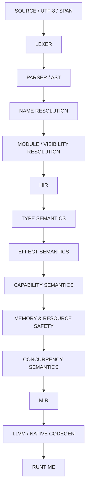
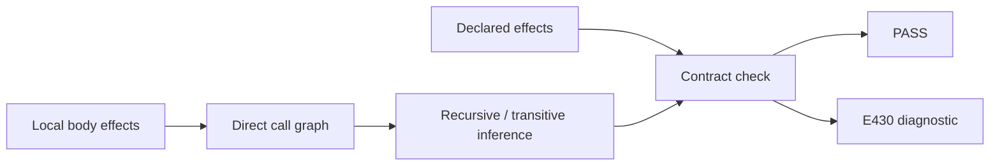

# TEDVİN

**Türkçe kodlama için tasarlanmış bir programlama dili ve geliştirme ortamı.**

*A programming language and development environment designed for coding in Turkish.*


> **Türkçe kod. Gerçek compiler semantiği. Uzun vadeli native toolchain hedefi.**

---

## TEDVİN nedir?

TEDVİN, Türkçe kodlama için tasarlanmış bir programlama dili ve geliştirme ortamıdır.

Amaç birkaç İngilizce anahtar kelimeyi Türkçeye çevirmek değildir. Proje; kaynak koddan başlayıp lexer, parser, isim çözümleme, HIR, tür semantiği, hata tanıları ve effect analizine uzanan gerçek bir compiler mimarisi üzerinde geliştirilmektedir.

TEDVİN'in hedefi, Türkçe kod yazmanın yalnızca okunabilir bir sözdizimi değil, compiler tarafından güçlü ve tutarlı biçimde doğrulanan gerçek bir programlama deneyimi olmasıdır.

**English:** TEDVİN is being built as a real programming-language toolchain, not as a keyword-translation demo. The project combines a Turkish coding surface with compiler-enforced semantics, diagnostics, type reasoning, effect analysis, and a long-term native-toolchain direction.

---

# Neden farklı?

TEDVİN'in farkı tek bir özelliğin “dünyada ilk” olması değildir.

`Sonuç`, algebraic data types, traits veya effect sistemleri gibi fikirlerin tek başına TEDVİN'e özgü olduğu iddia edilmiyor. **Ayırt edici çizgi, bu fikirlerin Türkçe kodlama yüzeyi ve compiler-merkezli bir mimari içinde birlikte tasarlanmasıdır.**

## 1. Türkçe, gerçek dil yüzeyi

Türkçe yalnızca editörde gösterilen bir etiket katmanı değildir. Kabul edilmiş dil yüzeyindeki gerçek yapılardan bazıları:

```text
değer
değişken
eğer
değilse
iken
kır
sürdür
yapı
eşleştir
döndür
```

Türkçe Unicode tanımlayıcılar da compiler tarafından doğrudan desteklenir:

```text
değer şehir = "İzmir"
değişken sayaç = 0
```

Bu nedenle TEDVİN'in Türkçe yönü, UI çevirisinden farklıdır: Türkçe, kaynak programın doğrudan parçasıdır.

## 2. Tek semantik otorite

TEDVİN'de dilin gerçek anlamının dokümantasyon, IDE ve compiler arasında farklılaşması hedeflenmez.

**Compiler, dil semantiğinin tek otoritesi olarak tasarlanır.**

Builtin davranışları bile yalnızca isim benzerliğiyle bağlanmaz. Örneğin kullanıcı kendi `yaz` isimli fonksiyonunu tanımladığında bu fonksiyon, sırf adı `yaz` olduğu için builtin davranış veya builtin effect kazanmaz. Compiler gerçek semantic identity üzerinden karar verir.

Bu yaklaşımın hedefi:

```text
aynı kaynak
    ↓
aynı semantic kimlikler
    ↓
aynı type/effect sonucu
    ↓
deterministik diagnostic
```

## 3. `null` merkezli olmayan güvenli değer modeli

Kabul edilmiş tasarım yönünde ham `null`, güvenli dil modelinin merkezi değildir.

```text
Kullanıcı?
```

tam olarak:

```text
Seçenek<Kullanıcı>
```

anlamına gelen type sugar olarak tasarlanmıştır.

Kurtarılabilir hatalar ise resmi:

```text
Sonuç<T, H>
```

taşıyıcısıyla modellenir.

Bu iki model birbirine karıştırılmaz:

```text
Seçenek<T>  → değer var mı?
Sonuç<T,H>  → işlem başarılı mı, hata mı?
```

## 4. Error propagation açık bir semantic contract

TEDVİN'deki postfix `?`, genel amaçlı sihirli bir hata operatörü değildir.

Mevcut doğrulanmış semantic contract'ta:

```text
değer y = g()?
```

ifadesinde operand resmi `Sonuç<T,H>` olmalıdır. En yakın enclosing function yine uyumlu bir `Sonuç<R,H>` döndürmelidir.

Başarı durumunda değer açılır; hata durumunda en yakın fonksiyondan resmi `Hata(...)` dönüşü gerçekleşir.

Amaç, hata ergonomisi sağlarken taşıyıcı kimliğini ve type güvenliğini korumaktır.

## 5. Effect semantics çekirdeğin ciddi bir parçası

TEDVİN yalnızca:

> “Bu ifadenin tipi nedir?”

sorusunu modellemeyi hedeflemez.

Aynı zamanda:

> **“Bu kod dış dünyada ne yapıyor?”**

sorusunu da compiler düzeyinde ele alır.

Bugünkü doğrulanmış compiler yüzeyinde effect hattı şunları kapsar:

```text
declared effects
      +
local body effects
      +
direct call graph
      ↓
transitive / recursive effect inference
      ↓
public effect contract check
      ↓
PASS veya E430
```

Örnek tasarım:

```text
açık işlev ana() etkiler [EkranYaz] {
    yaz("Merhaba")
}
```

Temel public contract ilişkisi:

```text
actual effects ⊆ declared effects
```

Yani public bir fonksiyonun gerçekten yaptığı etkiler, bildirdiği contract'ın dışında kalamaz.

Bu, TEDVİN'in en önemli mimari yönlerinden biridir.

## 6. Effect ile capability aynı şey değildir

TEDVİN mimarisinde iki ayrı soru vardır:

```text
Effect
→ Kod ne yapıyor?

Capability
→ Bu eylemi hangi sınırlar içinde yapmasına izin var?
```

Effect sistemi bugün önemli ölçüde gerçek semantic yüzeye sahiptir.

Capability enforcement ise daha sonraki compiler aşamasıdır. Bu ayrım bilinçlidir; compiler'ın “eylem” ile “izin” kavramlarını tek bir belirsiz mekanizmada birleştirmemesi hedeflenir.

## 7. Küçük ve açıklanabilir core

TEDVİN'in core-first yasası basittir:

> Programın anlamını, statik garantilerini veya güvenlik sınırlarını belirlemeyen şeyler sırf kullanışlı oldukları için dil çekirdeğine alınmaz.

Bu nedenle aşağıdakilerin dil core'u yerine stdlib/package katmanında büyümesi hedeflenir:

```text
HTTP
JSON
database drivers
GUI
web frameworks
AI / ML
cloud SDKs
image / audio processing
```

Bu yaklaşım, dil çekirdeğini küçük, deterministik, açıklanabilir ve genişlemeye dayanıklı tutmayı amaçlar.

---

# Bugün ne var?

## Doğrulanmış compiler yüzeyi

Mevcut private geliştirme snapshot'ında:

| Doğrulama | Durum |
|---|---:|
| Compiler unit tests | **627 PASS** |
| Lexer fixture suite | **PASS** |
| Resolver fixture suite | **PASS** |
| Bootstrap compiler implementation | **Rust** |
| Stability | **Experimental / pre-release** |

Bugün doğrulanmış semantic yüzey aşağıdaki alanları kapsar:

- Türkçe anahtar kelimeler ve Türkçe Unicode tanımlayıcılar
- immutable `değer` binding
- explicit mutable `değişken` binding
- assignment validation
- `Mantıksal`
- equality / inequality
- ordered comparisons
- logical operations
- `eğer` / `değilse`
- `iken`
- `kır` / `sürdür`
- nominal `yapı`
- named-field construction
- typed field access
- generic types
- generic functions
- Algebraic Data Types
- generic ADT payloads
- `eşleştir`
- payload binding
- exhaustiveness checking
- unreachable-pattern detection
- official `Seçenek<T>`
- official `Sonuç<T,H>`
- `T?` type sugar
- postfix `expr?` result propagation
- HIR-based semantic layers
- structured compiler diagnostics
- terminal diagnostic renderer
- local effect facts
- call-graph effect propagation
- recursive effect inference
- public effect-contract enforcement

> Bu liste bir stable-release iddiası değildir. Bugünkü doğrulanmış compiler geliştirme yüzeyini gösterir.

---

# Compiler mimarisi

TEDVİN'in uzun vadeli çekirdek mimari hattı:



**Bu şema hem mevcut hem gelecekteki katmanları gösterir.** Capability enforcement, memory/resource safety, concurrency, MIR, LLVM native codegen ve runtime bugün tamamlanmış ürün yeteneği olarak sunulmamaktadır.

## Katmanların görevi

| Katman | Temel soru |
|---|---|
| AST | Kaynakta hangi yapı yazıldı? |
| Resolver | Bu isim gerçekte hangi sembol? |
| HIR | Çözülmüş semantic program nasıl temsil ediliyor? |
| Type | Bu değer / ifade hangi tür? |
| Effect | Bu kod ne yapıyor? |
| Capability | Bu eyleme izin var mı? |
| Safety | Bu işlem güvenli yapılabilir mi? |
| MIR | Backend'e hangi anlam taşınacak? |

Mimari hedef, yeni package veya tooling katmanlarının parser, type veya safety kurallarını gizlice değiştirememesidir.

---

# Effect semantics

Effect hattı TEDVİN'in bugünkü teknik vitrininin en karakteristik parçalarından biridir.



Bugünkü accepted semantic modelde:

- declared effect set'leri compiler tarafından taşınır,
- builtin effect facts semantic identity üzerinden üretilir,
- function-local effect set'leri çıkarılır,
- user-function call graph oluşturulur,
- acyclic transitive propagation yapılabilir,
- recursive SCC'ler üzerinden fixed-point effect inference yapılır,
- public function effect contract'ları actual effect'lerle karşılaştırılır,
- undeclared public effects deterministik `E430` diagnostic üretebilir.

Bu yapı, ileride dosya, ağ, süreç veya başka dış dünya etkilerinin compiler tarafından daha görünür hale getirilebilmesi için bir semantic temel oluşturur.

---

# Güvenli dil yönü

TEDVİN'in uzun vadeli güvenlik hedefi, “daha çok özellik” eklemekten önce açık semantic sınırlar kurmaktır.

## Kabul edilmiş yön

```text
raw null merkezli model      → hedef değil
hidden untyped exceptions    → primary model değil
inheritance-centered core    → hedef değil
name-based builtin magic     → hedef değil
implicit unsafe              → hedef değil
```

## Memory / resource safety hedefi

Gelecekteki güvenli kod contract'ının yönü:

```text
use-after-free      → mümkün olmamalı
double-free         → mümkün olmamalı
dangling reference → mümkün olmamalı
unsafe              → açık ve lokal olmalı
```

Ordinary code'un kullanıcıyı sürekli açık lifetime annotation yazmaya zorlamaması da tasarım hedeflerinden biridir.

**Exact ordinary-heap strategy henüz kilitlenmiş değildir.**

Value semantics, move/linear resources, regions ve RC/ARC-benzeri teknikler arasındaki kesin denge ayrı bir design/research audit ile belirlenecektir.

Bu belirsizlik saklanmıyor: TEDVİN çözülmemiş bir memory modelini çözülmüş gibi sunmamaktadır.

---

# TEDVİN geliştirme ortamı

TEDVİN yalnızca compiler adı olarak tasarlanmıyor. Kabul edilmiş UX tasarım yönünde ayrı bir Türkçe geliştirme ortamı da bulunuyor.

## Core Workbench

Planlanan ana çalışma yüzeyi:

```text
Project / File Navigator
        +
.tr Code Editor
        +
Syntax Highlighting
        +
Derle / Çalıştır controls
        +
Sorunlar
        +
Çıktı
        +
Terminal
```

## ANLAM Lens

Kodun yanında contextual semantic bilgiyi kullanıcıya açıklanabilir biçimde göstermek hedefleniyor.

Örneğin:

```text
inferred type
declared effect
actual / inferred effect
effect contract state
symbol context
```

Amaç raw compiler dump göstermek değil; compiler'ın bildiği anlamı geliştiriciye kullanılabilir biçimde açmak.

## Derleyici Görünümü

İsteğe bağlı high-level pipeline inspection yüzeyi:

```text
Kaynak
  ↓
Lexer
  ↓
Parser
  ↓
Resolver
  ↓
HIR
  ↓
Type Snapshot
  ↓
Effect Inference
  ↓
Effect Contract
```

MIR ve LLVM bu görünümde yalnızca future boundary olarak düşünülmektedir.

> Bu geliştirme ortamı bölümü kabul edilmiş tasarım/prototip yönünü anlatır. Production desktop binding veya live native Build/Run bugün tamamlanmış yetenek olarak sunulmamaktadır.

## Tooling yönü

```text
structured diagnostics
        ↓
terminal renderer
        ↓
CLI orchestration
        ↓
JSON diagnostics
        ↓
LSP
        ↓
TEDVİN live checking
```

Gerçek `derle / çalıştır` akışı, native backend ve runtime yeteneği oluşmadan “hazır” sayılmayacaktır.

---

# Sıradaki büyük compiler adımı

## Traits · Bounds · Methods

Sıradaki planlanan ana semantic kapsam, behavior abstraction ve methods katmanıdır.

Kabul edilmiş tasarım yönünde hedeflenen Türkçe yüzey:

```text
davranış
uygula
öz
```

Planlanan V1 kapsamı:

- static traits / behavior contracts
- generic bounds
- multiple bounds
- inherent implementations
- trait implementations
- immutable `öz` receiver
- associated types
- qualified associated-type projection
- stable trait / method identity
- static coherence rules
- method effect integration
- nominal / generic operator traits
- indexed `Yinelenebilir` substrate

Örnek generic-bound yönü:

```text
T: A + B<X>
```

Bu immediate milestone içinde özellikle hedeflenmeyenler:

```text
dynamic dispatch
trait objects
specialization
default / generic methods
where clauses
ownership / borrow semantics
iterator için syntax
```

`için`, gerçek iterable substrate oluşmadan compiler'a özel bir kestirme olarak eklenmemektedir.

---

# Yol haritası

```mermaid
flowchart LR
    A["FOUNDATION<br/>Bindings · Control Flow · Types"] --> B["DATA<br/>Structs · Generics · ADT · Match"]
    B --> C["SAFE VALUES<br/>Seçenek · Sonuç · ?"]
    C --> D["ABSTRACTION<br/>Traits · Bounds · Methods"]
    D --> E["MODULES<br/>Imports · Visibility"]
    E --> F["EFFECTS<br/>Registry · Contracts"]
    F --> G["CAPABILITIES"]
    G --> H["MEMORY / RESOURCE SAFETY"]
    H --> I["CONCURRENCY"]
    I --> J["MIR"]
    J --> K["LLVM / NATIVE"]
    K --> L["RUNTIME"]
```



## 1 — Foundation

Bugün doğrulanmış çekirdek çizgi:

```text
bindings
→ boolean/comparison
→ structured control flow
→ nominal data
→ generics
→ ADT
→ exhaustive match
→ Seçenek / Sonuç
→ error propagation
```

## 2 — Abstraction & boundaries

Sıradaki yön:

```text
traits / bounds / methods
→ modules / imports / visibility
→ generalized effect registry
→ capability checking
```

Package ekosisteminin bu temellerden önce compiler semantic'lerini değiştirmesine izin verilmemesi hedeflenir.

## 3 — Safety core

Memory/resource modeli için önce ayrı design/research audit, ardından bounded semantic implementation adımları planlanmaktadır.

Sonraki concurrency yönü:

```text
safe mutable sharing
ownership / resource transfer
task lifetime foundations
cancellation foundations
data-race prevention
effect / capability interaction
```

Core Beta öncesi ayrıca FFI safety contract gerekecektir.

## 4 — Native toolchain

Safety foundations yeterince sağlamlaştıktan sonra hedeflenen backend hattı:

```text
MIR contract
→ HIR to MIR
→ MIR validation
→ LLVM codegen
→ minimum native runtime
→ executable pipeline
```

**LLVM mimari yöndür; bugünkü hazır yetenek değildir.**

## 5 — Stdlib & packages

Core dışında büyümesi planlanan alanlardan bazıları:

```text
collections
text helpers
math
path / file / environment
time / date
JSON
networking
random
encoding / hashing
test support
web frameworks
database drivers
GUI / mobile
game tooling
AI / ML
cloud SDKs
```

Ana yasa: package'lar parser grammar'ını, type meaning'i, memory-safety law'ı veya compiler semantic authority'yi gizlice değiştiremez.

---

# Tasarım ilkeleri

| Alan | TEDVİN yönü |
|---|---|
| Binding | Immutable by default; mutation explicit |
| Optional values | `T?` tam olarak `Seçenek<T>` |
| Recoverable errors | `Sonuç<T,H>` |
| Error propagation | Explicit postfix `?`, official `Sonuç` only |
| Data model | Nominal structures + ADT |
| Data branching | Exhaustive pattern matching |
| OOP direction | Composition / behavior contracts |
| Effects | Ayrı compiler semantic layer |
| Capabilities | Effect'ten ayrı permission layer |
| Builtins | Semantic identity, name guessing değil |
| Memory | Safety-first; exact heap strategy intentionally open |
| Concurrency | Safety contract before production native race |
| Backend | Own AST/HIR/MIR direction; LLVM later |
| Core | Small, deterministic, explainable, extension-safe |

---

# Kod nasıl görünüyor?

Aşağıdaki görseller mevcut doğrulanmış compiler testlerinden türetilmiş TEDVİN örnekleridir.

## Nominal yapılar


Bu örnekte Türkçe identifiers, nominal `yapı`, nested construction, typed field access ve function typing aynı programda birlikte görülür.

## ADT + `eşleştir`


Bu örnekte generic structure, generic ADT, qualified variants, payload binding ve `eşleştir` aynı semantic model içinde yer alır.

## `Sonuç<T,H>` + `?`


Bu örnek, resmi `Sonuç<T,H>` taşıyıcısı ile kontrollü postfix error propagation yüzeyini gösterir.

---

# Core olmayanlar

TEDVİN her özelliği ana dile koymayı hedeflemiyor.

Örneğin aşağıdakiler core-language feature olarak tasarlanmamaktadır:

```text
HTTP
JSON
SQL / ORM
GUI
web frameworks
AI frameworks
cloud SDKs
image / audio processing
database drivers
```

Aynı şekilde V1 core yönünde şu fikirler de varsayılan hedef değildir:

```text
raw null
hidden untyped exception-first semantics
unrestricted macros
unrestricted semantic compiler plugins
inheritance-centered class hierarchy
implicit unsafe
```

---

# Bugün neyi iddia etmiyoruz?

Şeffaflık bu vitrinin parçasıdır.

TEDVİN bugün:

- stable release değildir
- native executable pipeline'ı tamamlanmış değildir
- LLVM backend'i hazır değildir
- production desktop IDE binding'i hazır değildir
- capability enforcement henüz uygulanmış değildir
- memory/resource safety modelini bitmiş gibi sunmaz
- concurrency safety modelini bitmiş gibi sunmaz

Bunlar roadmap'te ayrı ve açık katmanlar olarak tutulmaktadır.

---

# Kaynak kod erişimi

TEDVİN compiler kaynak kodu aktif geliştirme sırasında **private** tutulmaktadır.

Bu repository, projenin halka açık **geliştirme vitrini**dir.

Public tarafta dilin amacı, doğrulanmış özellikler, gerçek kod örnekleri, mimari yön, geliştirme ortamı vizyonu ve roadmap paylaşılır.

Compiler kaynak kodunun erişim ve dağıtım politikası daha sonra duyurulacaktır.

---

# TEDVİN

**Türkçe kodlama için tasarlanmış bir programlama dili ve geliştirme ortamı.**

**Turkish coding surface · Real compiler semantics · Explicit effect direction · Native toolchain roadmap**

*Active development · Experimental / pre-release*
